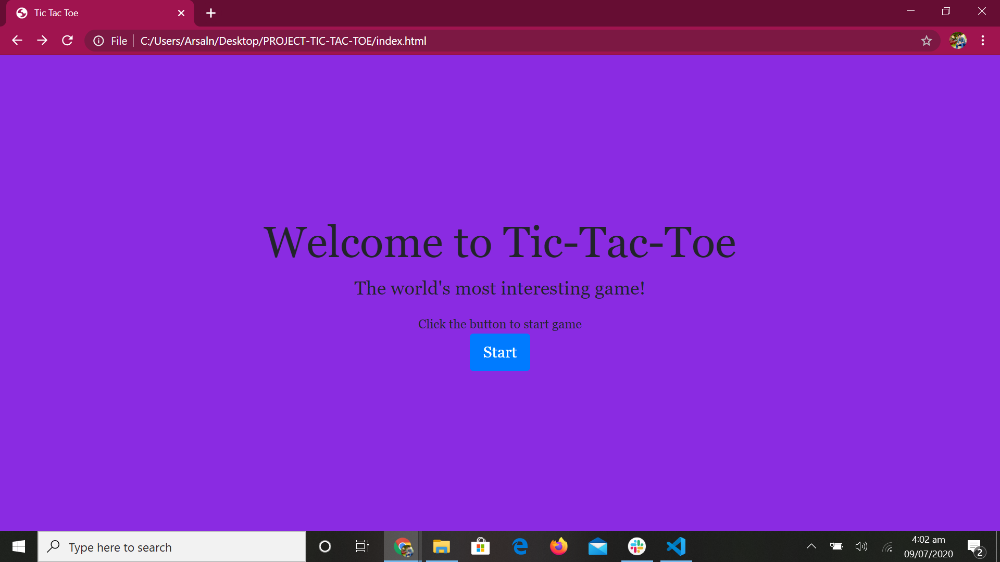
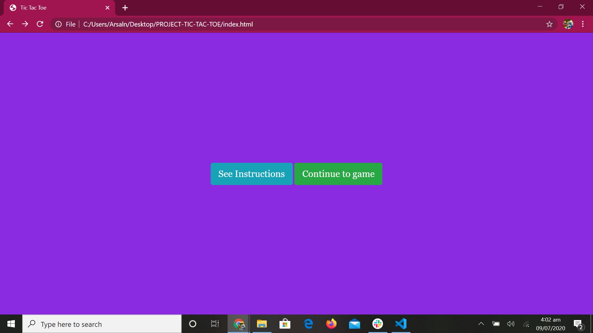
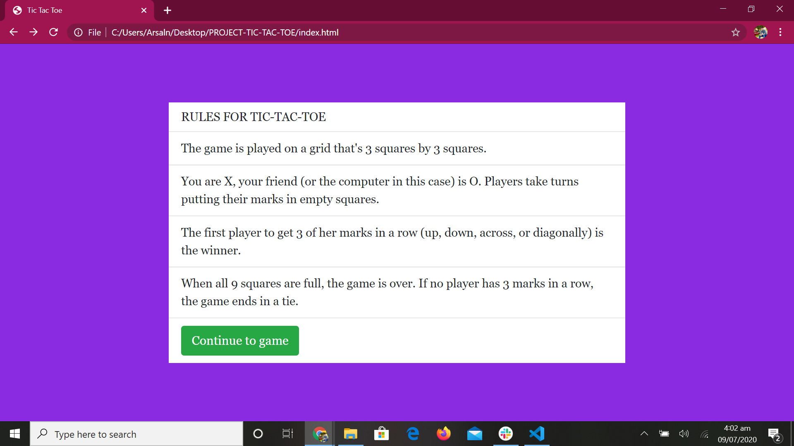
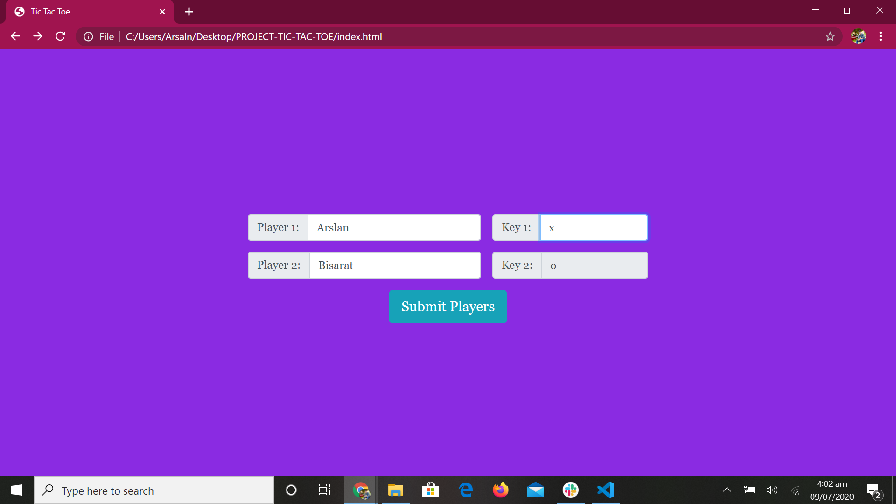
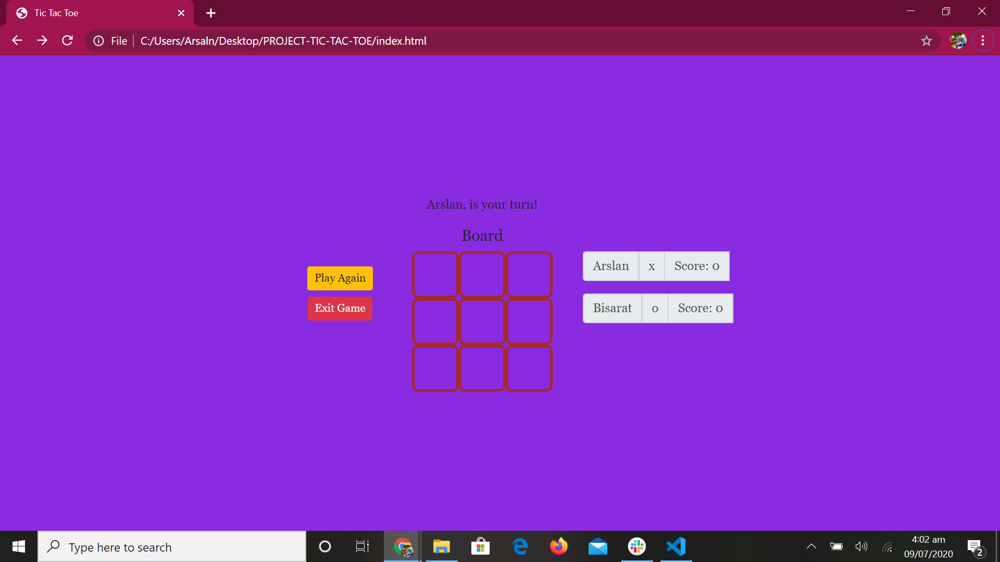

# PROJECT-TIC-TAC-TOE
Tic-tac-toe, noughts and crosses, or Xs and Os is a game for two players, X and O, who take turns marking the spaces in a 3×3 grid. The player who succeeds in placing three of their marks in a horizontal, vertical, or diagonal row is the winner.
 

> get instructins or start playing

> Rules to play

> Player's information

> Board to Play

## Built With

- Html
- CSS
- Javascript

## Live Demo

[Live Demo Link](https://rawcdn.githack.com/arslanbisharat/PROJECT-TIC-TAC-TOE/53f9126f9e4b1763f31849989ed53122eb53dad8/index.html)

## Local Host
In order to play this game clone this repo and open tictactoe.html in your desiered browser

## Author

 **Muhammad Arslan**

- Github: [@githubhandle](https://github.com/arslanbisharat)
- Twitter: [@twitterhandle](https://twitter.com/arslan_bisharat-2020bb156)
- Linkedin: [linkedin](https://www.linkedin.com/in/muhammad-arslan)

## 🤝 Contributing

Contributions, issues and feature requests are welcome! Start by:
* Forking the project.
* Cloning the project to your local machine
* `cd` into the Youtube-Replica project directory
* Run `git checkout -b your-branch-name`
* Make your contributions
* Push your branch up to your forked repository
* Open a Pull Request with a detailed description to the development branch of the original project for a review

## Special Credit
  Thank you [meli castorena](https://github.com/mcastorena0316) and [MaryAnn Chukwuka](https://github.com/adaorachi) for writing clean code [here](https://github.com/mcastorena0316/js-tictactoe)

## 📝 License

This project is [MIT](https://opensource.org/licenses/MIT) licensed.
